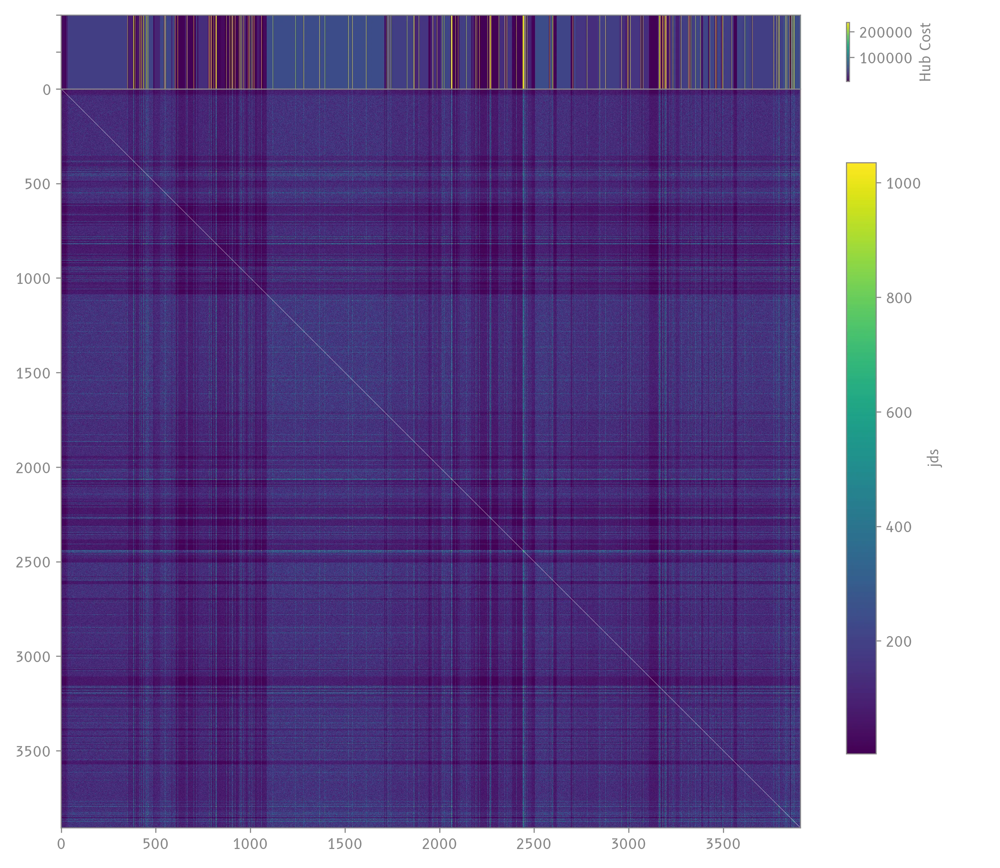
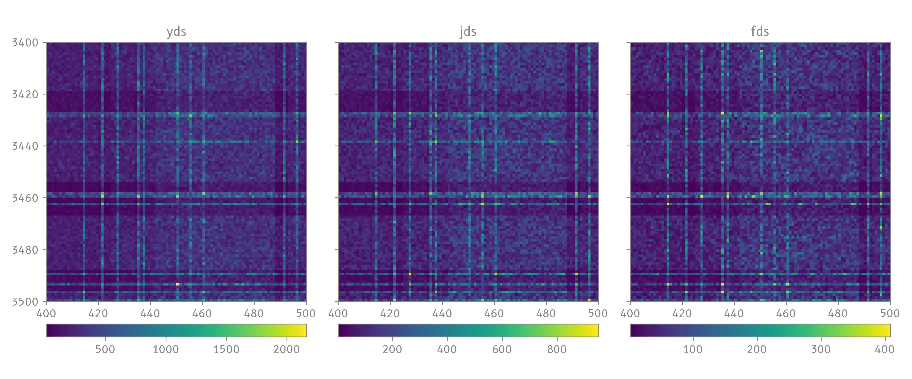
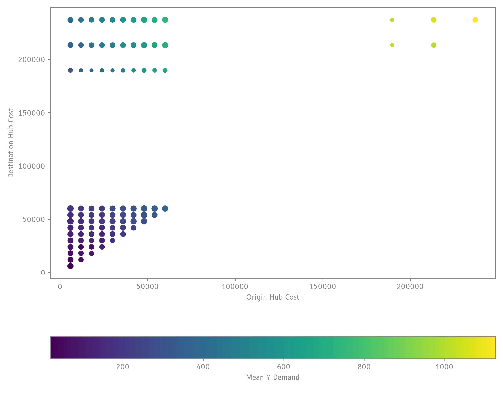
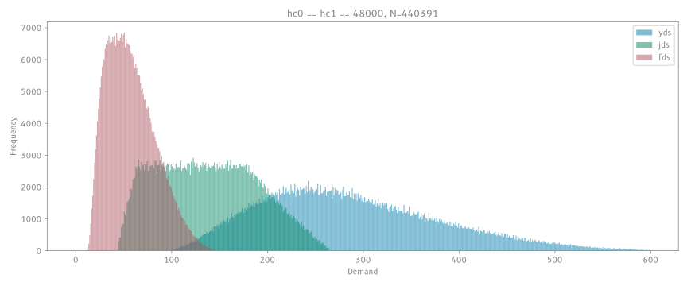

!!! note
    This document details the ongoing effort to uncover the demand formula. Contributions are welcome.

## Basic Observations

There are $n=3907$ airports in the game. A route can be constructed between two airports, and are associated with a **unique, undirected** demand. This means there are $\frac{n(n-1)}{2}=7630371$ possible demand values in the game!

Right now, we store each demand value in a giant database, and the goal is to find a *compressed* formula that generates the demand instead.

Below is a visualisation of the data collected in early 2020[^1]:

This matrix shows the $J$ demand between airport ID $i$ (x axis) and airport ID $j$ (y axis). Note that since $D_{i \rightarrow j}=D_{j \rightarrow i}$, the upper right triangle is essentially a mirror of the bottom left.

A closer slice:

Some observations:

- airports with greater base hub cost $C$ tend to yield greater *average* demand.
- very high demand (red dots) are sometimes located at intersections between two high-hub-cost pairs.
- values are highly randomised and have little correlation between $y$, $j$, $f$.

To confirm this, all hub cost pairs were grouped to plot their mean demand:

Indeed, the combination of high hub costs correlate with higher demand.

The following analyses will focus on the case where the hub cost for both origin and destination are $\$48000$.

## Distributions

Plotting $y$, $j$, $f$ in 3D space reveals that the possible values occupy a "slanted pinhole"-like volume with clear bounds:

<video controls loop src="../../assets/video/3d_demand_anim.webm" width="100%" preload="none" poster="../../assets/img/demand-research/3d_demand.webp"></video>

One dimension also seem to correspond to the equivalent demand $y+2j+3f$.

## Hypothesis for algorithm

1. one pseudorandom value is first generated for the equivalent demand $y+2j+3f$.
2. two pseudorandom values are generated in $[0, 1]$, corresponding to how economy-like or business-like the route is
3. a transformation is then applied and used to compute $y$, $j$, $f$.

## Transformed Space

??? note "Details for the projective trapezoidal inverse mapper"

    **Problem Definition**

    The problem is to find the inverse isoparametric mapping from physical space $\mathbb{R}^3$ to the logical unit cube $\Omega = [0, 1]^3$. While general hexahedral inversion typically requires iterative numerical methods (e.g., Newton-Raphson), the specific geometry of our data allows for a closed-form analytical solution.

    The source volume is a perspective frustrum with two key constraints:

    1. The "near" plane is a uniform scaling of the "far" plane ($\mathbf{p}_{near} = k \cdot \mathbf{p}_{far}$). All projection lines converge at the origin.
    2. The cross-sections are trapezoids where the horizontal edges are parallel to the x-axis (constant $y$).

    **The Forward Transformation**

    The forward map $\mathbf{x}(u,v,w)$ maps logical coordinates to physical space using trilinear interpolation. Due to the frustum constraint, this simplifies to a perspective projection:

    $$ \mathbf{x}(u,v,w) = [k(1-w) + w] \cdot \mathbf{x}_\text{far}(u,v) $$

    Here, the term $s(w) = k(1-w) + w$ acts as a projective scaling factor. Any point $\mathbf{x}$ is collinear with the origin and a corresponding point $\mathbf{x}_\text{far}$ on the far plane.

    **The Inverse Transformation**

    The inverse mapping recovers $(u, v, w)$ by decoupling the depth and lateral components.

    *1. Depth Recovery ($w$)*

    We first recover the logical depth $w$ by solving for the projective scalar $s$. Since all points with the same logical depth lie on a plane parallel to the far face, we can use the plane equation $\mathbf{N} \cdot \mathbf{p} - d = 0$ of the far plane.

    For a query point $\mathbf{x}$, its projection on the far plane is $\mathbf{x}/s$. Substituting this into the plane equation yields:

    $$ s = \frac{\mathbf{N} \cdot \mathbf{x}}{d} $$

    Since $s$ varies linearly with $w$ (from $k$ at $w=0$ to $1$ at $w=1$), we can recover $w$ directly:

    $$ w = \frac{s - k}{1 - k} $$

    *2. Lateral Mapping ($u, v$)*

    With $s$ known, we project the point onto the far plane: $\mathbf{x}_\text{far} = \mathbf{x} / s$. The problem reduces to finding $(u, v)$ within the 2D quadrilateral of the far face.

    Because of the trapezoidal constraint (horizontal edges), we can decouple the 2D bilinear inversion into two 1D linear interpolations:

    - Solve for $v$: Since the $y$-coordinate depends only on $v$ (and not $u$), we solve for $v$ using simple linear interpolation along the $y$-axis.
    - Solve for $u$: We compute the $x$-intercepts of the left and right edges at the determined $v$ and linearly interpolate $u$ between them.

Applying the inverse transformation to the data points yields the following distribution in the $(u, v, w)$ space:

<video controls loop src="../../assets/video/transformed_space_anim.webm" width="100%" preload="none" poster="../../assets/img/demand-research/transformed_space.webp"></video>

We see nice curved bands in this 3D lattice structure.

Slicing by $y+2j+3f$ bands reveals the values lie on highly ordered curves.

<video controls loop src="../../assets/video/transformed_slices_anim.mp4" width="100%" preload="none" poster="../../assets/img/demand-research/transformed_slices.webp"></video>

## Future work

- Investigate the PRNG and curves

[^1]: Back then, collecting data with automated tools was not against the TOS.
